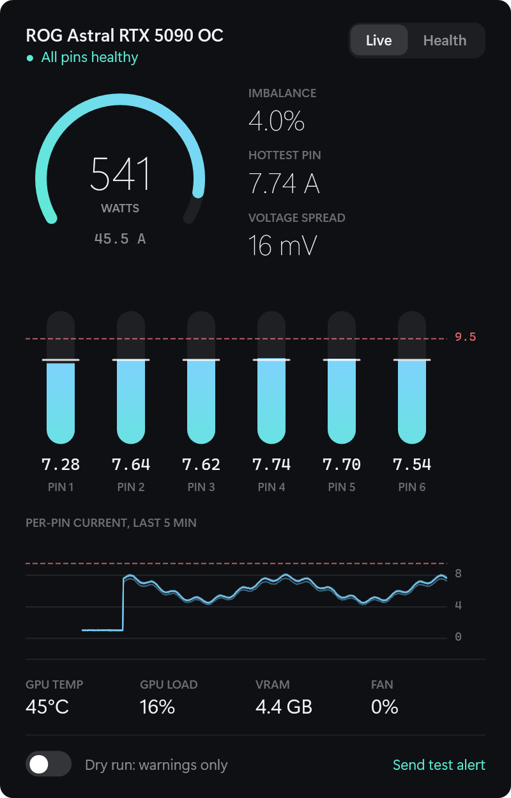

# PinSentinel

Per-pin power-connector monitoring, warning, throttle and safety shutdown for the
ASUS ROG Astral GeForce RTX 5090.

PinSentinel reads the current and voltage on each of the six +12 V pins of the
card's 12V-2x6 connector twice a second. If one pin carries too much, the pins
fall out of balance, or a pin stops carrying current, it warns you, cuts GPU
power, and shuts the PC down if the fault does not clear.



The screenshots in this repository use the built-in demo feed, not real readings.

- [User manual](docs/MANUAL.md): install, daily use, arming, configuration, troubleshooting
- [Design notes](docs/DESIGN.md): sensor protocol, rules, state machine, verification record

## Why

The RTX 5090 pulls up to 600 W through one connector with six +12 V pins.

- 600 W at 12 V is about 50 A, or 8.3 A per pin when shared perfectly. Each pin
  is rated for 9.5 A.
- The card joins all six pins into one rail and does not balance them. Current
  divides by contact and wire resistance alone, so one worn or badly seated
  contact pushes its share onto the others. der8auer measured over 20 A on one
  wire with others near 2 A, and about 150 °C at the PSU-side plug.
- The PSU sees a normal total load, so its over-current protection never trips.

The ROG Astral has a shunt per pin and a monitoring chip that reports each pin's
voltage and current. ASUS's GPU Tweak III warns on it, and since version 2.1.8.0
can optionally shut the PC down, but only above a fixed 12.5 A, after a delay of
minutes, with the option off by default and GPU Tweak III running. PinSentinel
uses the same sensor from a background service, acts on imbalance as well as
absolute current, throttles before it shuts down, and reacts in seconds.

## Features

- **Background service.** Starts at boot, needs no user logged on, restarts on failure.
- **Rules with hold times.** Per-pin over-current, load-relative imbalance, open
  pin, voltage spread between pins, and sensor loss.
- **Graduated response.** Desktop warning, then GPU throttle, then forced shutdown
  if the fault survives throttling or comes back. Severe faults shut down at once.
- **Dry run.** Logs and announces what it would do without acting. This is the default.
- **Tray dashboard.** Live per-pin levels, power gauge, five-minute graph, GPU
  temperature, load, VRAM and fan.
- **Health trend.** Tracks each pin's share of the load and its supply-path
  resistance across days, and flags drift long before a limit trips.
- **Self-tests.** A test alert and a 20-second real throttle test, both from the tray.
- **Evidence.** Daily CSV logs, and an incident file with the last two minutes of
  samples whenever it throttles or shuts down.

## Supported hardware

| Card | PCI subsystem | Status |
|---|---|---|
| ROG Astral RTX 5090 OC | `1043:89E3` | Developed and verified on this card |
| ROG Astral RTX 5090D OC, 5090 LC, 5090 OC White, ROG Matrix 5090 | `1043:89EA`, `89EC`, `8A2E`, `8A61` | Recognised, untested |
| ROG Astral RTX 5090 BTF OC | `1043:8A5A`, `8A3C` | Recognised, untested. Only measured when powered through the 12V-2x6 socket |
| ROG Astral RTX 5080, 5080 OC, 5080 OC White, 5080 OC Hatsune Miku | `1043:89DF`, `89DE`, `8A2B`, `8A45` | Recognised, untested |

ASUS is the only vendor that puts per-pin sensing on the card itself, so no
other card can be supported. MSI (GPU Safeguard) and Corsair measure per pin
inside the power supply instead, which this project does not read.

Windows 10 or 11, the NVIDIA driver and the
[.NET 10 Desktop Runtime](https://dotnet.microsoft.com/download/dotnet/10.0) are
required. The acrylic dashboard backdrop needs Windows 11.

## Install

1. Download `PinSentinelSetup-<version>.exe` from the
   [latest release](https://github.com/daytime10ca/PinSentinel/releases/latest).
2. Run it and accept the administrator prompt. The installer is not code-signed,
   so Windows SmartScreen may ask you to confirm with **More info**, **Run anyway**.
3. In the tray icon's right-click menu, tick **Start with Windows**.

The installer puts the program in `C:\Program Files\PinSentinel`, installs and
starts the service, adds a Start menu shortcut, and starts the tray app. Running
a newer installer upgrades in place and keeps your settings and logs.

The guard starts in dry run. See the [manual](docs/MANUAL.md#arming) before arming it.

To remove it, use **Settings, Apps, Installed apps**. Logs in
`%ProgramData%\PinSentinel` are kept.

To build and install from source instead, see
[Building from source](docs/MANUAL.md#building-from-source).

## Default thresholds

| Condition | Warn | Throttle | Shutdown |
|---|---|---|---|
| Any pin current | >= 9.0 A for 10 s | >= 9.5 A for 10 s | >= 13 A for 3 s, or >= 16 A for 1 s |
| Pin deviation from the six-pin mean (total >= 15 A) | > 20 % for 30 s | > 35 % for 15 s | > 50 % for 30 s |
| Pin < 0.5 A while total >= 15 A | 5 s | 15 s | 45 s |
| Voltage spread between pins under load | > 150 mV for 30 s | > 250 mV for 15 s | n/a |
| Sensor unreadable | 5 reads | n/a | n/a |

A throttle-level fault still present 10 s after throttling, or returning within
10 minutes of the throttle being released, also forces a shutdown. Everything is
configurable; see the [manual](docs/MANUAL.md#configuration).

## Repository layout

| Path | Contents |
|---|---|
| `src/PinSentinel.Core` | Sensor read, frame parser, rule engine, guard state machine, CSV log, health analysis |
| `src/PinSentinel.Service` | Windows service: notifications, throttle, shutdown, status and control pipes |
| `src/PinSentinel.Tray` | Tray icon and dashboard (WPF) |
| `src/PinSentinel.Cli` | `probe` and `watch` for checking the sensor by hand |
| `tests/PinSentinel.Tests` | xUnit tests for the parser, rules, guard and health analysis |
| `src/PinSentinel.Setup` | The installer and uninstaller |
| `scripts` | Installer build, install-from-source script, icon generator |
| `docs` | Manual, design notes, screenshots |

## Development

```
dotnet build
dotnet test
dotnet run --project src/PinSentinel.Cli -- probe          # one raw and parsed sensor frame
dotnet run --project src/PinSentinel.Cli -- watch          # live readings, warnings only
dotnet run --project src/PinSentinel.Tray -- --demo        # dashboard on synthetic data
dotnet run --project src/PinSentinel.Tray -- --demo fault  # same, with a simulated bad pin
.\scripts\build-installer.ps1                              # dist\PinSentinelSetup-<version>.exe
```

The rule engine and guard take time from the samples and have no hardware
dependencies, so they are tested with synthetic traces.

## Limits

- It sees only the six +12 V pins at the card. Not the ground pins, not the
  PSU-side plug, and no connector temperature.
- It samples at 2 Hz. It catches sustained faults, not sub-second transients.
- It depends on Windows and the NVIDIA driver running. A hung system is unprotected.
- The sensor protocol is reverse-engineered by the community, not documented by ASUS.
- BTF cards powered through the GC-HPWR slot bypass the shunts.

A native ATX 3.1 12V-2x6 cable, careful seating, few re-plugs and a modest power
limit still matter. A hardware in-line monitor covers what software cannot.

## Status

Version 1.1.0. Verified on a ROG Astral RTX 5090 OC: sensor reading as a
service, readings against GPU Tweak III, desktop alerts, the real throttle
(592 W to 108 W and back), and a 68-minute load baseline. The forced shutdown
has only run in dry run. Details are in the [design notes](docs/DESIGN.md#verification-record).

## Prior art

- [12vhpwr-guard](https://github.com/humza-khalid/12vhpwr-guard): Windows over-current watchdog for the same cards
- [astral-hwmon](https://github.com/ksokolowski/astral-hwmon): Linux hwmon driver and guard
- [GPUPinMonitor](https://github.com/xsmphr/GPUPinMonitor): Windows desktop widget
- [astral-power-monitor](https://github.com/EthDevOps/astral-power-monitor): Linux service

## Sources

- [ASUS: how Power Detector+ alerts you to abnormal current](https://rog.asus.com/articles/guides/how-gpu-tweaks-power-detector-alerts-you-to-abnormal-current-on-your-rog-astral-graphics-card/)
- [LACT issue 906: Astral per-pin monitoring via I2C](https://github.com/ilya-zlobintsev/LACT/issues/906)
- [Igor's Lab: 12VHPWR plug reaches 150 °C on the PSU side](https://www.igorslab.de/en/12vhpwr-plug-reaches-150c-on-the-psu-side-when-connected-to-the-geforce-rtx-5090-design-problem-instead-of-user-error/)
- [Igor's Lab: the 12V-2x6 connector](https://www.igorslab.de/en/rest-in-peace-12vhpwr-connector-welcome-12v-2x6-connector/)

## License

[MIT](LICENSE).

## Disclaimer

PinSentinel reduces risk; it does not remove it. It is not a substitute for a
correctly seated, undamaged cable, and it comes with no warranty.
