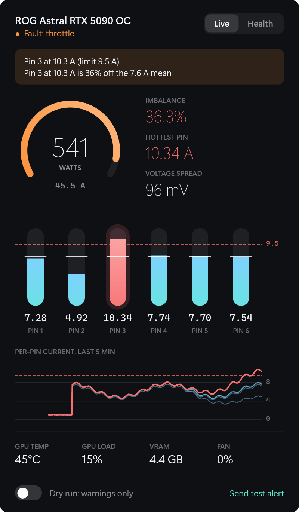
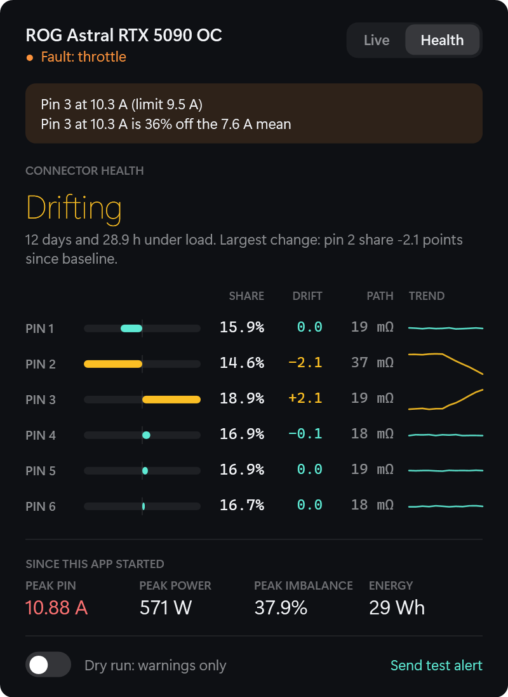

# PinSentinel user manual

## Contents

- [Install, upgrade, uninstall](#install-upgrade-uninstall)
- [The tray icon](#the-tray-icon)
- [The dashboard](#the-dashboard)
- [What happens on a fault](#what-happens-on-a-fault)
- [Arming](#arming)
- [Self-tests](#self-tests)
- [Logs and incident files](#logs-and-incident-files)
- [Configuration](#configuration)
- [Troubleshooting](#troubleshooting)
- [Questions](#questions)

## Install, upgrade, uninstall

You need Windows 10 or 11, a supported ROG Astral card, the NVIDIA driver and the
.NET 10 SDK.

Open PowerShell **as administrator** in the repository folder:

```
.\scripts\install.ps1
```

The script:

1. Stops and removes any previous PinSentinel service and closes the tray app.
2. Publishes the service to `C:\Program Files\PinSentinel` and the tray app to
   its `Tray` subfolder.
3. Creates the auto-start `PinSentinel` service, set to restart on failure.
4. Adds a Start menu shortcut.
5. Prints the service status and its first event-log entries.

Then start **PinSentinel** from the Start menu and tick **Start with Windows** in
the tray icon's right-click menu.

**Upgrade** by running the same script again. Your edited `appsettings.json`, the
armed state and all logs are kept. The service is down for a few seconds while it
runs, so do it when the GPU is idle.

**Uninstall** with `.\scripts\install.ps1 -Uninstall`. Logs and incident files in
`%ProgramData%\PinSentinel` are left in place; delete that folder by hand if you
want them gone.

## The tray icon

The icon shows six bars, one per pin, whose heights follow the live current.

| Icon | Meaning |
|---|---|
| Teal bars | All pins healthy |
| Amber bar or bars | A pin at or above 9.0 A, or a warning is active |
| Red bar or bars | A pin at or above 9.5 A, or a throttle or shutdown fault is active |
| Grey | The service is not running or the sensor cannot be read |

Hover for connector power and the highest pin. A Windows notification appears
when the severity rises.

Left-click opens the dashboard. Right-click gives:

- **Open**
- **Open log folder**
- **Run throttle test (20 s)...** See [Self-tests](#self-tests).
- **Start with Windows**
- **Exit**. This closes only the tray app. The service keeps protecting the card.

## The dashboard

The dashboard closes when you click elsewhere or press Esc. You can drag it.

### Live tab



- **Header.** Card name and a one-line state: All pins healthy, Warning, Fault,
  GPU throttled, Sensor not readable, or Waiting for the service.
- **Banner.** Appears only during a fault and says which pin and why.
- **Power gauge.** Connector power out of 600 W, with total current beneath.
- **Imbalance.** How far the worst pin is from the six-pin average. Shown only
  above 15 A total, because the figure means nothing at idle.
- **Hottest pin.** The highest single pin current.
- **Voltage spread.** The gap between the highest and lowest pin voltage.
- **Pin capsules.** One per pin. The dashed red line is the 9.5 A rating. The
  white tick across each capsule is the six-pin average.
- **Graph.** All six pin currents over the last five minutes. A pin more than
  10 % from the average is drawn in a warning colour.
- **GPU row.** Temperature, load, VRAM in use and fan speed, from the NVIDIA driver.

### Health tab



This tab reads the daily logs and looks for slow change.

- **Verdict.** *Building baseline* until three days each have at least five
  minutes under load. Then *Stable* or *Drifting*.
- **Share.** Each pin's average fraction of the total current under load on the
  most recent day. An even share is 16.7 %. The bar shows how far above or below.
- **Drift.** Change in share, in percentage points, between the most recent day
  and the baseline (the earliest days on record, up to five).
- **Path.** An estimate of the resistance of each pin's supply path, from how far
  its voltage falls between idle and load. It includes the power supply's own
  droop, so compare pins with each other rather than trusting the absolute value.
- **Trend.** Share per day, all six drawn to the same scale.
- **Since this app started.** Peak pin current, peak power, peak imbalance and
  energy used. These reset when the tray app restarts.

*Drifting* means a pin's share moved by 1.0 point or more, or its path resistance
rose by 30 % and at least 3 mΩ. These thresholds are starting points. A drifting
verdict is a prompt to reseat or inspect the cable, not a fault.

### Footer

- **Switch.** Arms or disarms the guard. See [Arming](#arming).
- **Send test alert.** See [Self-tests](#self-tests).

## What happens on a fault

Every rule has a hold time, so a brief spike does nothing.

1. **Warning.** A message box appears on the desktop and the tray icon changes.
   Nothing else happens.
2. **Throttle.** The GPU's power limit is set to its minimum and its clock is
   locked low, which cuts connector power by about 80 %. An incident file is
   written. The throttle stays on for at least 2 minutes and until the fault has
   been absent for 1 minute, then is released.
3. **Shutdown.** Windows shuts down after a 10-second on-screen notice, closing
   programs without saving. This happens when:
   - a throttle-level fault is still present 10 seconds after throttling, or
   - a fault returns within 10 minutes of the throttle being released, or
   - a shutdown-level rule trips (13 A for 3 s, 16 A for 1 s, 50 % imbalance for
     30 s, or an open pin for 45 s).

In dry run, steps 2 and 3 are announced and logged with a `[dry run]` prefix, and
the incident file is still written, but the GPU and Windows are left alone.

After a throttle or shutdown, check the cable at both ends before running the GPU
hard again. If the service stops while the GPU is throttled, the throttle stays on
until you reboot.

## Arming

A fresh install is in dry run. Before arming:

1. Leave it running through a few hours of real GPU load.
2. Check the log shows no warnings (`Open log folder`, or the Health tab).
3. Press **Send test alert** and confirm the message box appears.
4. Run the **throttle test** under load and confirm it reports PASSED.

Then flip the switch in the dashboard footer and confirm. The change takes effect
immediately and survives restarts. Flip it back to return to dry run.

The armed state is stored in `%ProgramData%\PinSentinel\state.json` and overrides
`DryRun` in `appsettings.json`.

## Self-tests

**Test alert.** Sends a message box through the same path a real warning uses.
Confirms that the background service can reach your desktop.

**Throttle test.** Applies the real throttle for 20 seconds, whether or not the
guard is armed, then restores the GPU. Start a game or benchmark first. Expect a
large frame-rate drop while it runs. When it finishes, a message shows connector
power before, during and after:

| Result | Meaning |
|---|---|
| PASSED | Power fell to under 60 % and recovered after release |
| FAILED | A throttle command failed (named in the message) or power did not fall enough |
| PARTIAL | Power fell but did not recover to 80 % of the starting level |
| INCONCLUSIVE | The GPU was drawing under 200 W, so there was nothing to measure |

There is no test for the real shutdown.

## Logs and incident files

Everything is under `%ProgramData%\PinSentinel`.

| Path | Contents |
|---|---|
| `logs\pins-YYYY-MM-DD.csv` | One sample every 5 seconds while healthy, every sample while any rule is active. Kept 30 days. |
| `incidents\incident-*.csv` | The last 240 samples (about 2 minutes) before a throttle or shutdown, with the reason on the first line. Never deleted automatically. |
| `state.json` | The armed state set from the tray. |

CSV columns: `time, v1..v6` (volts), `a1..a6` (amps), `severity`, `rules`.

The service also writes to the Windows Application event log under the sources
`PinSentinel` and `PinSentinel.Service`.

Explorer may show today's log as 0 bytes while the service has it open.

## Configuration

Edit `C:\Program Files\PinSentinel\appsettings.json` as administrator, then
restart the service:

```
Restart-Service PinSentinel
```

All settings sit under the `PinSentinel` key. Durations are `hh:mm:ss`.

### General

| Setting | Default | Meaning |
|---|---|---|
| `DryRun` | `true` | Starting mode. Overridden by the tray switch once that has been used. |
| `PollIntervalMs` | `500` | Time between sensor reads. |
| `DataDirectory` | `%ProgramData%\PinSentinel` | Where logs, incidents and state are kept. |
| `BaselineLogSeconds` | `5` | How often a healthy sample is logged. |
| `LogRetentionDays` | `30` | Daily logs older than this are deleted. |
| `FlightRecorderSamples` | `240` | Samples written to an incident file. |
| `ThrottleClockMhz` | `500` | GPU clock ceiling while throttled. |
| `ShutdownDelaySeconds` | `10` | Notice period before Windows powers off. |

### Rules

Each limit is a `Threshold` and a `Hold`: the condition must be true continuously
for the hold time.

| Setting | Default | Meaning |
|---|---|---|
| `LoadGateAmps` | `15.0` | Imbalance, open-pin and voltage rules apply only above this total current. |
| `PinAmpsWarn` | 9.0 A, 10 s | Any pin at or above the threshold. |
| `PinAmpsThrottle` | 9.5 A, 10 s | |
| `PinAmpsShutdown` | 13.0 A, 3 s | |
| `PinAmpsShutdownFast` | 16.0 A, 1 s | |
| `ImbalanceWarn` | 0.20, 30 s | Largest pin deviation from the mean, as a fraction of the mean. |
| `ImbalanceThrottle` | 0.35, 15 s | |
| `ImbalanceShutdown` | 0.50, 30 s | |
| `OpenPinAmps` | `0.5` | A pin below this while loaded counts as open. |
| `OpenPinWarn` / `Throttle` / `Shutdown` | 5 s / 15 s / 45 s | |
| `VoltSpreadWarn` | 0.150 V, 30 s | Highest minus lowest pin voltage under load. |
| `VoltSpreadThrottle` | 0.250 V, 15 s | |
| `SensorLossWarnReads` | `5` | Consecutive failed reads before a warning. |

### Guard

| Setting | Default | Meaning |
|---|---|---|
| `ThrottleGrace` | 10 s | A fault still present this long after throttling forces a shutdown. |
| `ThrottleMinHold` | 2 min | Minimum time the throttle stays on. |
| `ClearTime` | 1 min | Time without a fault before the throttle is released. |
| `RetriggerWindow` | 10 min | A fault returning this soon after release forces a shutdown. |

## Troubleshooting

**The tray icon is grey and the dashboard says "Waiting for the service".**
The service is not running. Check with `Get-Service PinSentinel` and start it with
`Start-Service PinSentinel` from an elevated prompt. If it will not stay running,
look in Event Viewer, Windows Logs, Application.

**"Sensor not readable".**
The service is running but the card did not return a valid frame. This is normal
for a few seconds during a driver update. If it persists, run
`dotnet run --project src/PinSentinel.Cli -- probe` from the repository; it
prints the NVAPI status code. Confirm the card is a supported model.

**"No supported ROG Astral card found".**
The card's subsystem ID is not in the supported list. `probe` prints the ID it found.

**Warnings appear during benchmarks at the full 600 W.**
At 600 W a healthy connector already carries about 8.5 to 8.7 A on its busiest
pin, close to the 9.0 A warning. Either lower the card's power limit a little, or
raise `PinAmpsWarn`. Leave `PinAmpsThrottle` at the 9.5 A rating.

**The throttle test reports FAILED.**
The message names the command that failed. The throttle uses `nvidia-smi`, which
ships with the driver; confirm `nvidia-smi` runs from an elevated prompt.

**The GPU is stuck slow after a fault.**
The throttle is released automatically when the fault clears. If the service was
stopped while throttled, reboot, or run `nvidia-smi -rgc` from an elevated prompt.

**The Start menu shortcut shows a blank icon after an upgrade.**
Windows caches icons. Sign out and back in, or restart Explorer.

**Disable everything quickly.**
`Stop-Service PinSentinel` from an elevated prompt stops all monitoring and action.

## Questions

**Does it need GPU Tweak III or HWiNFO?**
No. It reads the card directly and runs alongside either.

**Does it work when nobody is logged on?**
Yes. Monitoring, throttle and shutdown run in the service. Only the pop-ups and
the dashboard need a logged-on user.

**How much does it use?**
The service uses about 50 to 60 MB of memory and well under 1 % of one core, and
writes under 2 MB of logs a day. The tray app shows roughly 20 to 30 MB in Task
Manager while the dashboard is closed.

**Can other users on the PC disarm it?**
Anyone logged on at the machine can arm, disarm, or run the tests. No command can
trigger a shutdown by itself.
